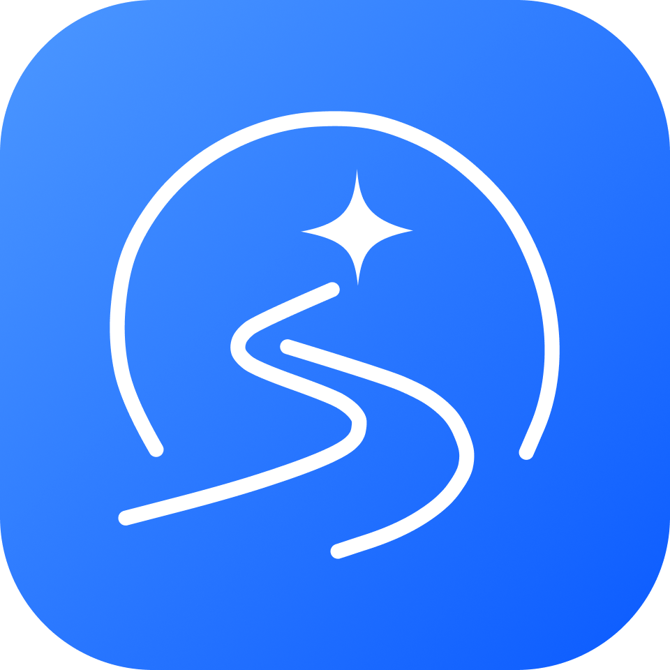

<p align="center">
  
</p>

<h1 align="center">MIRAERO · 미래로</h1>

<p align="center">
  <strong>목표만 정하면, 페이스는 미래로가 맞출게요.</strong>
</p>

<p align="center">
  사회초년생의 목표 달성을 함께하는<br/>
  <strong>자산관리 페이스메이커</strong>
</p>

<br/>

---

## 🏃 About MIRAERO

**미래로**는 사회초년생이 자신의 현재 자산을 바탕으로
목표를 설정하고, 목표까지의 **자산관리 로드맵과 적정 저축 페이스**를 확인할 수 있는 서비스입니다.

목표 설정부터 로드맵, 페이스메이커, AI 코치까지
**목표를 세우는 것에서 끝나지 않고 실제 달성까지 이어지는 자산관리 경험**을 제공합니다.

---

## 👨‍💻 Contributors

| <a href="https://github.com/hyeonjjshh-bot"></a> | <a href="https://github.com/SongCodeMaster"></a> | <a href="https://github.com/mantalgap"></a> | <a href="https://github.com/kamzajjang"></a> |
| :---: | :---: | :---: | :---: |
| **이현주** | **송승윤** | **복원준** | **김지원** |
| [GitHub](https://github.com/hyeonjjshh-bot) | [GitHub](https://github.com/SongCodeMaster) | [GitHub](https://github.com/mantalgap) | [GitHub](https://github.com/kamzajjang) |

---

## ✨ Core Features

|     | 기능                | 설명                                                             |
| --- | ------------------- | ---------------------------------------------------------------- |
| 🎯  | **목표 관리**       | 원하는 목표와 금액·기간을 설정하고 달성 가능성을 확인합니다.     |
| 🗺️  | **자산관리 로드맵** | 현재 자산을 기준으로 목표까지 필요한 자산관리 계획을 제공합니다. |
| 🏃  | **페이스메이커**    | 목표 달성에 필요한 저축 페이스와 현재 진행 상황을 비교합니다.    |
| 🤖  | **AI 코치**         | 나의 금융 상황을 바탕으로 맞춤형 자산관리 조언을 제공합니다.     |
| 💰  | **금융상품 추천**   | 목표와 상황에 맞는 금융상품을 탐색할 수 있습니다.                |
| 🏛️  | **청년정책 추천**   | 분야·지역별 청년 정책을 쉽고 빠르게 확인할 수 있습니다.          |

---

## 🎯 Goal

### 목표를 정하면, 달성까지의 길이 보입니다.

목표 금액과 기간을 설정하면
현재 자산을 기준으로 목표 달성 가능성을 분석합니다.

```text
목표 설정
   ↓
현재 자산 분석
   ↓
달성 가능성 확인
   ↓
목표까지 필요한 저축액 계산
```

---

## 🗺️ Roadmap

### 지금에서 목표까지, 나만의 길을 만듭니다.

현재의 자산과 목표를 바탕으로
목표 달성에 필요한 과정을 **하나의 로드맵**으로 시각화합니다.

단순히 목표 금액만 보여주는 것이 아니라
**현재 → 과정 → 목표**의 흐름을 직관적으로 확인할 수 있습니다.

---

## 🏃 Pacemaker

### 목표까지, 나에게 맞는 속도로.

미래로의 핵심 기능인 **페이스메이커**는
목표 달성에 필요한 저축 속도와 현재의 진행 상황을 비교합니다.

> **"지금 나의 페이스는 목표에 맞게 가고 있을까?"**

현재 페이스를 확인하면서
목표까지 꾸준히 자산을 관리할 수 있습니다.

---

## 🤖 AI Coach

### 금융이 어려울 때, AI 코치에게 물어보세요.

사용자의 자산 및 소비 상황을 바탕으로
목표 달성을 위한 **맞춤형 금융 조언**을 제공합니다.

단순한 금융 정보 검색을 넘어
현재 나의 상황에서 **무엇을 어떻게 관리하면 좋을지** 대화형으로 안내합니다.

---

## 🛠️ Tech Stack

| Category | Stack |
| :---: | :--- |
| **Language** |    |
| **Framework** |   |
| **State Management** |  |
| **Styling** |  |
| **Build & API** |   |
| **Development** |    |

---

## 📂 Project Structure

```text
📦 miraero-frontend
 ┣ 📂 public
 ┃ ┗ 📜 mockServiceWorker.js       # MSW Service Worker
 ┣ 📂 src
 ┃ ┣ 📂 app                        # 앱 전역 설정
 ┃ ┃ ┣ 📂 layouts                  # 공통 레이아웃 · 내비게이션
 ┃ ┃ ┣ 📂 plugins                  # MSW 등 앱 플러그인
 ┃ ┃ ┗ 📂 router                   # Vue Router 설정
 ┃ ┃
 ┃ ┣ 📂 assets                     # 정적 리소스
 ┃ ┃ ┣ 📂 icons                    # SVG 아이콘
 ┃ ┃ ┣ 📂 images                   # 캐릭터 · 브랜드 이미지
 ┃ ┃ ┗ 📂 styles                   # Tailwind · 디자인 토큰
 ┃ ┃
 ┃ ┣ 📂 features                   # 도메인별 기능 모듈
 ┃ ┃ ┣ 📂 auth                     # 로그인 · 회원가입
 ┃ ┃ ┣ 📂 change                   # 변경 관련 기능
 ┃ ┃ ┣ 📂 coach                    # AI 코치
 ┃ ┃ ┣ 📂 collection               # 목표 컬렉션
 ┃ ┃ ┣ 📂 goal                     # 목표 설정 · 관리
 ┃ ┃ ┣ 📂 mypage                   # 마이페이지
 ┃ ┃ ┣ 📂 pacemaker                # 페이스메이커
 ┃ ┃ ┣ 📂 products                  # 금융상품 추천
 ┃ ┃ ┣ 📂 roadmap                  # 목표 로드맵
 ┃ ┃ ┣ 📂 spending                 # 소비 분석 · 시뮬레이션
 ┃ ┃ ┗ 📂 youth-policy              # 청년정책 추천
 ┃ ┃
 ┃ ┣ 📂 mocks                      # MSW Mock API
 ┃ ┃ ┣ 📂 fixtures                 # Mock 데이터
 ┃ ┃ ┣ 📂 handlers                 # 도메인별 API 핸들러
 ┃ ┃ ┗ 📜 browser.js               # MSW 브라우저 설정
 ┃ ┃
 ┃ ┣ 📂 pages                      # 라우트별 페이지 컴포넌트
 ┃ ┣ 📂 shared                     # 공통 모듈
 ┃ ┃ ┣ 📂 api                      # Axios 클라이언트 · 인터셉터
 ┃ ┃ ┣ 📂 composables              # 공통 Composition API 로직
 ┃ ┃ ┣ 📂 constants                # 공통 상수
 ┃ ┃ ┣ 📂 lib                      # 날짜 · 금액 유틸리티
 ┃ ┃ ┗ 📂 ui                       # 공통 UI 컴포넌트
 ┃ ┃
 ┃ ┣ 📂 stores                     # 앱 전역 Pinia Store
 ┃ ┣ 📜 App.vue                    # 루트 컴포넌트
 ┃ ┗ 📜 main.js                    # 앱 진입점
 ┃
 ┣ 📜 .env.example                 # 환경변수 예시
 ┣ 📜 index.html                   # Vite HTML 진입점
 ┣ 📜 package.json                 # 스크립트 · 의존성
 ┣ 📜 tailwind.config.js           # Tailwind CSS 설정
 ┗ 📜 vite.config.js               # Vite 빌드 설정
```

---

---

<br/>

<p align="center">
  <strong>목표를 세우는 순간부터, 목표에 도착하는 순간까지.</strong>
</p>

<p align="center">
<strong>MIRAERO</strong>와 함께 당신의 미래까지 달려보세요.
</p>
